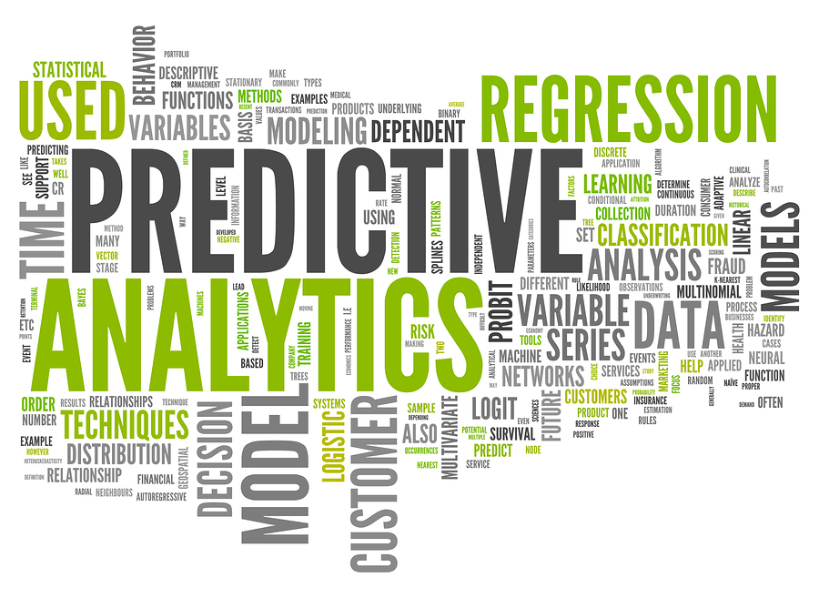

```{r setup, include=FALSE}
# knitr::opts_chunk$set()
```

#



# 怎麼挑模型

## `Model Selection` 根據`問題`與`資料型態` {.fullpage}


## `Cross Validation` 交叉驗證 {.fullpage}


# 黑魔法！


# 解釋

## Explainable AI

- [2017-11-11 吳沛燊@用深度學習解決醫療尚未滿足的需求](https://www.slideshare.net/secret/cD4aqxLJgAdYdn)

- [Explainable AI 是什麼？為什麼 AI 下判斷要可以解釋？](https://trustable.ai/what-is-explainable-ai-why-we-need-it/)

## Explainable AI

### 確認它的判斷合理（verification of the system）

### 改良它的算法（improvement of the system）


## Explainable AI

### 從它身上學習（learning from the system）

* AlphaGO

### 符合法規要求（compliance to legislation）

* 歐盟 GDPR 規定使用者有「要求解釋的權力」（right to explanation）
  
## LIME {.fullpage}

-  Local Interpretable Model-Agnostic Explanations

- ["Why Should I Trust You?" Explaining the Predictions of Any Classifier. By Marco Tulio Ribeiro, Sameer Singh and Carlos Guestrin from the University of Washington in Seattle](https://arxiv.org/pdf/1602.04938.pdf)


## LIME {.fullpage}

-  Local Interpretable Model-Agnostic Explanations

- ["Why Should I Trust You?" Explaining the Predictions of Any Classifier. By Marco Tulio Ribeiro, Sameer Singh and Carlos Guestrin from the University of Washington in Seattle](https://arxiv.org/pdf/1602.04938.pdf)


## LIME {.fullpage}

- Local Interpretable Model-Agnostic Explanations


## LIME {.fullpage}

- Local Interpretable Model-Agnostic Explanations


## LIME {.fullpage}

-  Local Interpretable Model-Agnostic Explanations


## LIME {.fullpage}

-  Local Interpretable Model-Agnostic Explanations


## LIME

### KDD2016 paper 573

<iframe width="560" height="315" src="https://www.youtube.com/embed/hUnRCxnydCc" frameborder="0" allowfullscreen></iframe>

## LIME

- [LIME in python](https://github.com/marcotcr/lime)

- [LIME in R](https://github.com/thomasp85/lime)


## LIME

### 基本概念

> - For each prediction to explain, permute the observation n times.

> - Let the complex model predict the outcome of all permuted observations.

> - Calculate the distance from all permutations to the original observation.

> - Convert the distance to a similarity score.

## LIME

### 基本概念

> - Select m features best describing the complex model outcome from the permuted data.

> - Fit a simple model to the permuted data, explaining the complex model outcome with the m features from the permuted data weighted by its similarity to the original observation.

> - Extract the feature weights from the simple model and use these as explanations for the complex models local behavior.

## LIME

### Feature Selection

- `none`: Use all features for the explanation.

- `forward selection`: Features are added one by one based on their improvements to a ridge regression fit of the complex model outcome.

- `highest weights`: The m features with highest absolute weight in a ridge regression fit of the complex model outcome are chosen.

## LIME

### Feature Selection

- `lasso`: The m features that are least prone to shrinkage based on the regularization path of a lasso fit of the complex model outcome is chosen.

- `tree`: A tree is fitted with log2(m) splits, to use at max m features. It may possibly select less.

- `auto`: Uses `forward selection` if m <= 6 and otherwise `highest weights`.

# Demo

## Demo

```{r init, warning=FALSE, message=FALSE}
library(lime)
library(MASS)
data(biopsy)

# First we'll clean up the data a bit
biopsy$ID <- NULL
biopsy <- na.omit(biopsy)
names(biopsy) <- c('clump thickness', 'uniformity of cell size', 
                   'uniformity of cell shape', 'marginal adhesion',
                   'single epithelial cell size', 'bare nuclei', 
                   'bland chromatin', 'normal nucleoli', 'mitoses',
                   'class')
```

## Demo

```{r lda}
# Now we'll fit a linear discriminant model on all but 4 cases
set.seed(4)
test_set <- sample(seq_len(nrow(biopsy)), 100)
prediction <- biopsy$class
biopsy$class <- NULL
model <- lda(biopsy[-test_set, ], prediction[-test_set])

sum(predict(model, biopsy[test_set, ])$class == prediction[test_set])/100
```

## Demo

```{r explainer}
# Train the explainer
explainer <- lime(biopsy[-test_set,], model, bin_continuous = TRUE, quantile_bins = FALSE)
# Use the explainer on new observations
explanation <- explain(biopsy[test_set[1:4], ], explainer, n_labels = 1, n_features = 4)
tibble::glimpse(explanation)
```

## Demo

```{r explanation}
explanation <- explain(biopsy[test_set[1:4], ], explainer, n_labels = 1, 
                       n_features = 4, kernel_width = 0.5, feature_select = "auto")
explanation[, 2:9]
```

## Demo

```{r plot, fig.width = 9}
plot_features(explanation, ncol = 2)
```

## Demo

### 使用外部 model 的範例

- [HR ANALYTICS: USING MACHINE LEARNING TO PREDICT EMPLOYEE TURNOVER](http://www.business-science.io/business/2017/09/18/hr_employee_attrition.html)

### 更多參考資料

- [Explaining complex machine learning models with LIME](https://shiring.github.io/machine_learning/2017/04/23/lime)

- [Introduction to Local Interpretable Model-Agnostic Explanations (LIME)](https://www.oreilly.com/learning/introduction-to-local-interpretable-model-agnostic-explanations-lime)